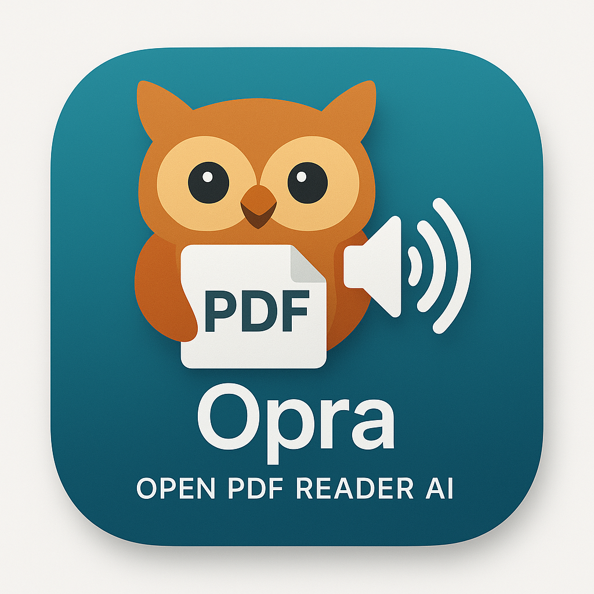

# Opra - Open PDF Reader AI



A simple macOS app that reads PDF documents aloud using AI-powered text-to-speech technology.

## How it works

Opra follows a simple three-step process:
1. **Extract** text from your PDF file
2. **Convert** text to speech using AI voices
3. **Play** the audio with progress tracking

```
PDF → Extract Text → AI Speech → Audio Playback
```

## Quick Start

1. **Open PDF**: Click "Select PDF" or press ⌘O
2. **Choose pages**: Select which pages to read
3. **Start reading**: Click play or press spacebar
4. **Control**: Use play/pause/stop and adjust speed

## Key Features

- **AI-Powered Voices**: High-quality text-to-speech using Ollama
- **Page Selection**: Read specific pages or entire document
- **Speed Control**: Adjust reading speed
- **Progress Tracking**: See current reading position
- **Keyboard Shortcuts**: ⌘O (open), Space (play/pause), ⌘S (stop)

## Requirements

- macOS 12.0 or later
- PDF files with readable text (not scanned images)
- Ollama installed for AI voices

## Installation

1. Download from [Releases](https://github.com/yourusername/Opra/releases)
2. Open DMG and drag to Applications
3. Launch Opra

## Setup Ollama (for AI voices)

1. Install [Ollama](https://ollama.ai)
2. Run `ollama serve` in Terminal
3. Select "Ollama TTS" in Opra settings
