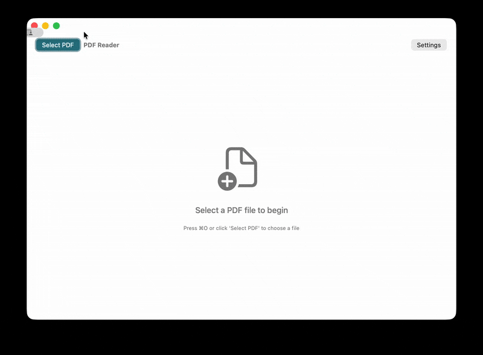

# Opra - Cross-Platform PDF Reader AI




A cross-platform application that reads PDF documents aloud using AI-powered text-to-speech technology. Available for both macOS and Windows.

## How it works

Opra follows a simple three-step process:
1. **Extract** text from your PDF file
2. **Convert** text to speech using AI voices
3. **Play** the audio with progress tracking

```
PDF → Extract Text → AI Speech → Audio Playback
```

## Quick Start

### macOS
1. **Open PDF**: Click "Select PDF" or press ⌘O
2. **Choose pages**: Select which pages to read
3. **Start reading**: Click play or press spacebar
4. **Control**: Use play/pause/stop and adjust speed

### Windows
1. **Open PDF**: Click "Select PDF" or press Ctrl+O
2. **Choose pages**: Select which pages to read
3. **Start reading**: Click play or press spacebar
4. **Control**: Use play/pause/stop and adjust speed

## Key Features

- **Cross-Platform**: Works on both macOS and Windows
- **AI-Powered Voices**: High-quality text-to-speech
- **Page Selection**: Read specific pages or entire document
- **Speed Control**: Adjust reading speed
- **Progress Tracking**: See current reading position
- **Keyboard Shortcuts**: 
  - macOS: ⌘O (open), Space (play/pause), ⌘S (stop)
  - Windows: Ctrl+O (open), Space (play/pause), Ctrl+S (stop)

## Requirements

### macOS
- macOS 12.0 or later
- PDF files with readable text (not scanned images)

### Windows
- Windows 10 version 1903 or later
- .NET 8.0 Runtime
- PDF files with readable text (not scanned images)

## Download & Installation

### Option 1: Download Pre-built Apps

1. Go to the [Releases page](https://github.com/kekko7072/Opra/releases)
2. Download the appropriate installer for your platform:
   - **macOS**: `.dmg` file
   - **Windows**: `.exe` installer
3. Install and launch the application

#### ✅ Code Signed

The apps are properly code-signed for their respective platforms, so they should install and run without security warnings.

### Option 2: Build from Source

1. Clone this repository:
   ```bash
   git clone https://github.com/kekko7072/Opra.git
   cd Opra
   ```

2. Build for your platform:

   **Build everything:**
   ```bash
   ./build.sh all          # macOS/Linux
   build.bat all           # Windows
   ```

   **Build specific platform:**
   ```bash
   ./build.sh macos        # macOS only
   ./build.sh windows      # Windows only
   ```

   **macOS (using Xcode):**
   ```bash
   cd macos
   open Opra.xcodeproj
   # Build and run in Xcode (⌘R)
   ```

   **Windows (using Visual Studio):**
   ```bash
   cd windows
   dotnet build -c Release
   dotnet run --project Opra
   ```

## Project Structure

```
Opra/
├── macos/                 # macOS SwiftUI application
│   ├── Opra.xcodeproj
│   └── Opra/
├── windows/               # Windows WinUI 3 application
│   ├── Opra.sln
│   └── Opra/
├── build.sh              # Build script (macOS/Linux)
├── build.bat             # Build script (Windows)
└── README.md
```

## Development

### Prerequisites

**macOS Development:**
- Xcode 14.0 or later
- macOS 12.0 or later

**Windows Development:**
- Visual Studio 2022 or later
- .NET 8.0 SDK
- Windows 10 SDK (10.0.19041.0 or later)

### Building

The project uses a unified build system that supports both platforms:

```bash
# Build everything
./build.sh all

# Build specific platform
./build.sh macos
./build.sh windows
```

### Architecture

The application uses platform-native implementations:

1. **macOS**: SwiftUI with native PDFKit and AVFoundation
2. **Windows**: WinUI 3 with iText7 and System.Speech

### Cross-Platform Building Notes

**Important:** Windows App SDK applications cannot be built on Linux/macOS using Docker due to Windows-specific build tool dependencies. 

To build the Windows version:
- Use a Windows machine or VM
- Use GitHub Actions with a Windows runner (recommended for CI/CD)
- Use cloud build services like Azure DevOps with Windows agents


