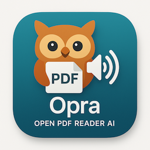

# Opra - Open PDF Reader AI




A simple macOS app that reads PDF documents aloud using AI-powered text-to-speech technology.

## How it works

Opra follows a simple three-step process:
1. **Extract** text from your PDF file
2. **Convert** text to speech using AI voices
3. **Play** the audio with progress tracking

```
PDF → Extract Text → AI Speech → Audio Playback
```

## Quick Start

1. **Open PDF**: Click "Select PDF" or press ⌘O
2. **Choose pages**: Select which pages to read
3. **Start reading**: Click play or press spacebar
4. **Control**: Use play/pause/stop and adjust speed

## Key Features

- **AI-Powered Voices**: High-quality text-to-speech
- **Page Selection**: Read specific pages or entire document
- **Speed Control**: Adjust reading speed
- **Progress Tracking**: See current reading position
- **Keyboard Shortcuts**: ⌘O (open), Space (play/pause), ⌘S (stop)

## Requirements

- macOS 12.0 or later
- PDF files with readable text (not scanned images)

## Download & Installation

### Option 1: Download Pre-built App

1. Go to the [Releases page](https://github.com/kekko7072/Opra/releases)
2. Download the latest `.dmg` file
3. Open the downloaded `.dmg` file
4. Drag the Opra app icon to your Applications folder
5. Launch Opra from your Applications folder

#### ✅ Notarized & Code Signed

The app is **properly code-signed and notarized by Apple**, so it should open directly without any security warnings. macOS will recognize it as a trusted application from an identified developer. 

### Option 2: Build from Source

1. Clone this repository:
   ```bash
   git clone https://github.com/yourusername/Opra.git
   cd Opra
   ```
2. Open `Opra.xcodeproj` in Xcode
3. Build and run the project (⌘R)


